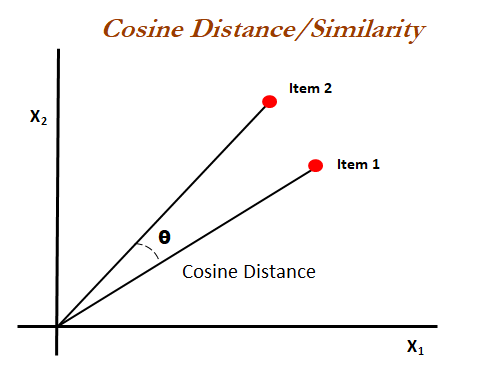

# MOVIE RECOMMENDATION SYSTEM
We will be creating a content-based recommender.
# Content-Based Movie Recommendation Systems:

Content-based methods are based on the similarity of movie attributes. Using this type of recommender system, if a user watches one movie, similar movies are recommended. For example, if a user watches a comedy movie starring Adam Sandler, the system will recommend them movies in the same genre or starring the same actor, or both. With this in mind, the input for building a content-based recommender system is movie attributes.
# Tech used
### PYTHON : for filtering data and machine learning part
### vector & cosine similarity : for showing movie recommendation
### STREAMLIT: for building a web application
### HEROKU : for deploying a web application
### tmdb3api : API for showing Movie details 

# Link to the working application 
CHECK OUT-> https://vkmvi.herokuapp.com/
# Snapshots of the application
###ss1
.png)
###ss2
.png)
###ss3
.png)
###ss4
.png)

# RUN STREAMLIT COMMAND ON YOUR TERMINAL
Command to run the web application on your system is streamlit run app.py

# How to get TMDB API key?
Create an account in https://www.themoviedb.org/ 

# Algorithm used for application
## Cosine similarity:
Cosine similarity measures the similarity between two vectors of an inner product space. It is measured by the cosine of the angle between two vectors and determines whether two vectors are pointing in roughly the same direction. It is often used to measure document similarity in text analysis.
## How does Cosine similarity works:
Cosine similarity is a metric used to measure how similar the documents are irrespective of their size. Mathematically, it measures the cosine of the angle between two vectors projected in a multi-dimensional space. The cosine similarity is advantageous because even if the two similar documents are far apart by the Euclidean distance (due to the size of the document), chances are they may still be oriented closer together. The smaller the angle, higher the cosine similarity.

## Dataset
I am using TMDB 5000 movies dataset to build the model.

dataset link https://www.kaggle.com/tmdb/tmdb-movie-metadata\
